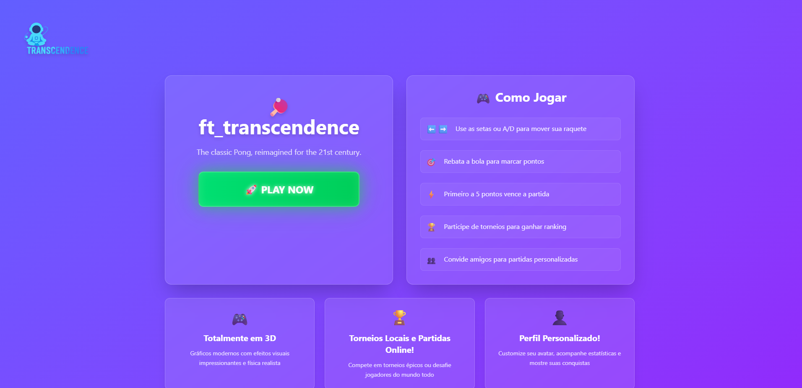
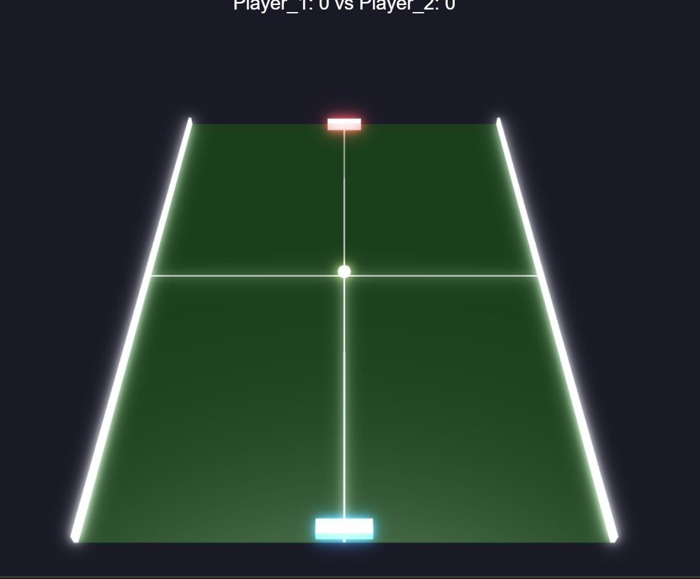

# 🕹️ Transcendence

Transcendence é um jogo online multiplayer inspirado no clássico Pong, desenvolvido como projeto final da formação da 42. O objetivo do projeto foi aplicar conceitos avançados de autenticação, jogo em tempo real e integração entre frontend e backend em um sistema completo e funcional.

---

## 🚀 Tecnologias Utilizadas

- 🟩 **Node.js** com **Fastify** (servidor backend)
- 🔷 **TypeScript** (frontend)
- 🎨 **Tailwind CSS** (estilização)
- 🧠 **SQLite** (banco de dados)
- 🔌 **Socket.IO** (comunicação em tempo real)
- 🛠️ **bundle.js** (empacotamento e renderização do jogo em 3D)
- 🔐 Autenticação com 2FA e OAuth (Google)
- 🐳 **Docker / Docker Compose** (ambiente de contêineres)

---

## 🧩 Funcionalidades

- 👤 Sistema de login com autenticação em duas etapas
- 🧑‍🤝‍🧑 Gerenciamento de amigos, status online e chat em tempo real
- 🏓 Jogo de Pong multiplayer (1v1)
- 🏆 Sistema de ranking
- 🎨 Customização de perfil com avatar
- 🧱 Contêinerização completa com Docker

---

## 🔧 Como rodar localmente


```sh
./ft_transcendence.sh setup # cria o .env e os certificados https

./ft_transcendence.sh clear # apaga .env, certificados e DBs


docker compose up # sobe todos os services, terminal fica travado com os logs

docker compose up -d # sobe todos os services, terminal livre

docker compose down # para os containers e os remove

docker compose down --rmi all # para os containers, os remove, e remove as imagens

docker compose logs -f frontend # mostra logs do container de front

docker compose logs -f user-service # mostra logs do container de user-service
```

---

## 📸 Screenshots




