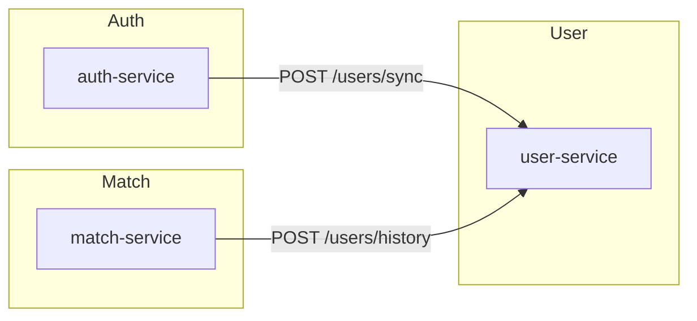

# 📦 Microservices Overview – ft_transcendence

Each service in this project has its own local README.

## Available Services

| Service        | Description                         | Docs                                          |
|----------------|-------------------------------------|-----------------------------------------------|
| auth-service   | Handles registration and 2FA        | [auth-service/README.md](./auth-service/README.md)   |
| match-service  | Manages tournament logic            | [match-service/README.md](./match-service/README.md) |
| user-service   | Profiles, avatars, friends, history | [user-service/README.md](./user-service/README.md)   |

---

## Service Communication



- **auth-service** ⟶ **user-service**  
  After a successful registration, sends:
  ```http
  POST http://user-service:3003/users/sync
  Content-Type: application/json

  { "alias": "john" }
  ```
- **match-service** ⟶ **user-service**  
  After a match ends, sends two calls:
  ```http
  POST http://user-service:3003/users/history
  Content-Type: application/json

  { "alias":"winner", "opponent":"loser", "result":"win", "date":"<ISO>" }

  POST http://user-service:3003/users/history
  Content-Type: application/json

  { "alias":"loser", "opponent":"winner", "result":"loss", "date":"<ISO>" }
  ```

JWT is required for all protected endpoints across services.
