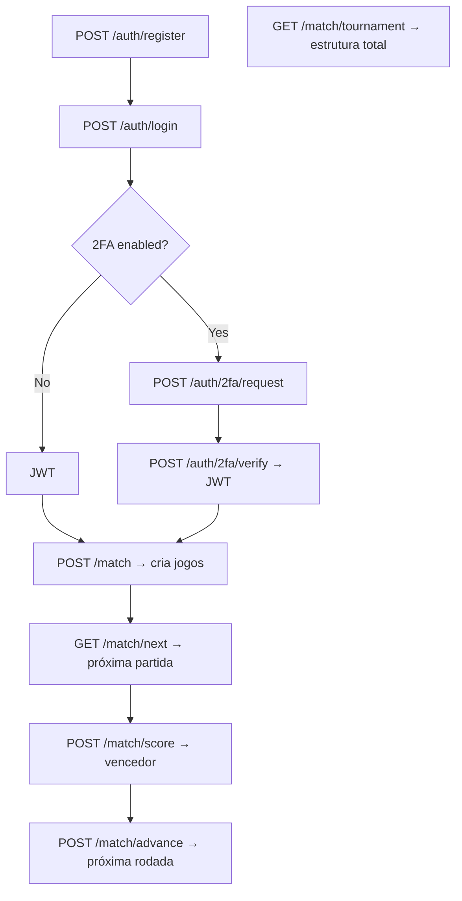

# 🎮 ft_transcendence - API (Microsserviços)

API backend baseada em **Fastify + SQLite**, com autenticação JWT e sistema de torneio com rounds, WO (walkover) e múltiplas fases.

---

## 🧰 Como rodar o projeto

```bash
make setup      # cria arquivos .env se necessário
make build      # compila os microsserviços
make up         # sobe auth-service e match-service
make logs       # acompanha logs dos serviços
```

- Auth: [`http://localhost:3001`](http://localhost:3001)
- Match: [`http://localhost:3002`](http://localhost:3002)

---

## 🔐 Auth-service

> **Base URL:** `http://localhost:3001/auth`

Todas as rotas abaixo retornam JSON.  
Rotas marcadas com [🔐 Requer autenticação] exigem o header:

```http
Authorization: Bearer <TOKEN>
```

---

### ✅ POST /auth/register

Registra um novo jogador.

#### Requisição:
```json
{
  "alias": "jorge",
  "password": "1234",
  "email": "jorge@email.com"
}
```

#### Resposta:
```json
{
  "success": true,
  "alias": "jorge"
}
```

---

### 🔓 POST /auth/login

Autentica o usuário com alias e senha.

#### Requisição:
```json
{
  "alias": "jorge",
  "password": "1234"
}
```

#### Possíveis respostas:
- Se o usuário **não tiver 2FA habilitado**:

```json
{
  "token": "eyJhbGciOi..."
}
```

- Se o usuário **tiver 2FA habilitado**:

```json
{
  "require2FA": true,
  "alias": "jorge"
}
```

---

### 🔐 POST /auth/2fa/request

Gera e envia o código 2FA para o e-mail.

> ⚠️ Requer apenas o alias, já que o login já foi feito.

#### Requisição:
```json
{
  "alias": "jorge"
}
```

#### Resposta:
```json
{
  "success": true,
  "message": "Code sent by email."
}
```

---

### 🔐 POST /auth/2fa/verify

Confirma o código e retorna um JWT.

#### Requisição:
```json
{
  "alias": "jorge",
  "code": "123456"
}
```

#### Resposta:
```json
{
  "token": "eyJhbGciOi..."
}
```

---

### 🛡️ POST /auth/2fa/enable [🔐 Requer autenticação]

Ativa a autenticação 2FA para o jogador logado.

#### Requisição:
```json
{
  "alias": "jorge"
}
```

#### Resposta:
```json
{
  "success": true,
  "message": "2FA enabled successfully."
}
```

---

### 🛡️ POST /auth/2fa/disable [🔐 Requer autenticação]

Desativa a autenticação 2FA para o jogador logado.

#### Requisição:
```json
{
  "alias": "jorge"
}
```

#### Resposta:
```json
{
  "success": true,
  "message": "2FA disabled successfully."
}
```

---

## 🏓 Match-service

> **Base URL:** `http://localhost:3002/match`

Todas as rotas abaixo [🔐 Requerem autenticação].

---

### 🧾 POST /match [🔐 Requer autenticação]

Cria a primeira rodada com os jogadores fornecidos.

#### Requisição:
```json
{
  "players": ["jorge", "tobias", "lucas"]
}
```

#### Resposta:
```json
{
  "matches": [
    { "player1": "jorge", "player2": "tobias" },
    { "wo": "lucas" }
  ]
}
```

---

### ⏭️ GET /match/next [🔐 Requer autenticação]

Retorna a próxima partida pendente (status = `"pending"`).

---

### 🏆 POST /match/score [🔐 Requer autenticação]

Define o vencedor de uma partida.

#### Requisição:
```json
{
  "matchId": 2,
  "winner": "jorge"
}
```

---

### ➕ POST /match/advance [🔐 Requer autenticação]

Gera a próxima rodada com os vencedores da rodada anterior (`status = done || wo`).

---

### 🧩 GET /match/tournament [🔐 Requer autenticação]

Retorna todas as rodadas agrupadas por fase.

---

## 🔁 Fluxo resumido (Frontend)



---

## 🔑 JWT para testes

Durante o desenvolvimento, você pode gerar manualmente um token JWT válido:

```js
require('jsonwebtoken').sign({ alias: 'dev', id: 42 }, 'jorge-super-secrets')
```

Use o token para testar o match-service sem passar pelo 2FA completo.

---

## 🧠 Convenções de `status` em partidas

| Status   | Significado |
|----------|-------------|
| `pending` | Partida ainda não resolvida |
| `done`    | Vencedor registrado manualmente |
| `wo`      | Jogador avançou automaticamente (walkover) |

---

## 📌 Notas para o frontend

- Sempre aguarde a resposta de `/match` ou `/advance` para saber a estrutura real.
- O frontend **não precisa gerar os confrontos** — só envia `["a", "b", "c", ...]`.
- Jogadores com `status = wo` já têm `winner` definido e **não devem entrar em jogos ativos**.
- Partidas com `player2 = null` não são válidas — são WO ou erro.

---

## 🔒 Segurança

- Toda rota protegida exige `Authorization: Bearer <TOKEN>`
- Usuários só podem alterar dados de sua própria sessão
- 2FA é obrigatório após login, mas pode ser desativado pelo usuário

---

## 📁 Microsserviços

| Serviço       | Porta         | Descrição                          |
|---------------|---------------|------------------------------------|
| auth-service  | `:3001`       | Registro, login, 2FA, JWT          |
| match-service | `:3002`       | Torneios, partidas, placar, rounds |