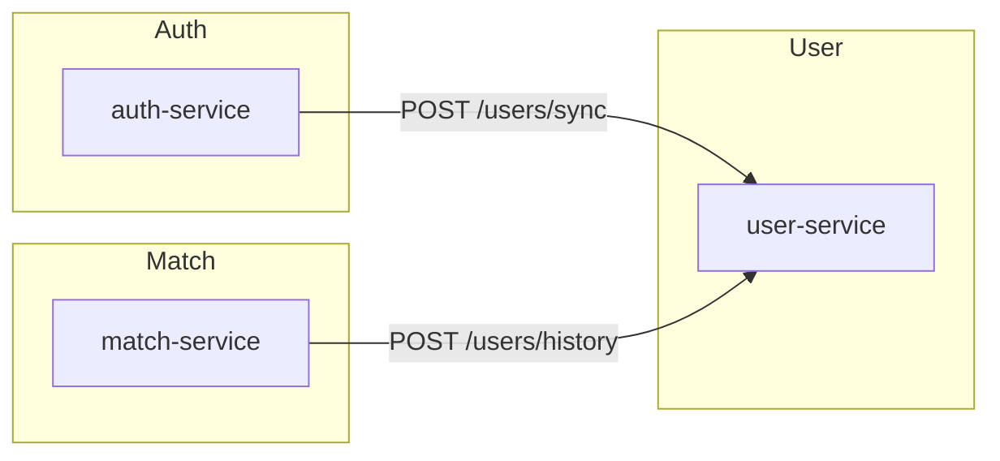

# 📦 Microservices Overview – ft_transcendence

A microservices architecture for a Pong-based transcendence project, featuring authentication, match management, and user profile services.

## 🚀 Quick Start

```bash
# Start everything
make up

# Stop everything  
make down

# Clean restart
make restart
```

## Available Services

| Service        | Description                         | Docs                                          |
|----------------|-------------------------------------|-----------------------------------------------|
| auth-service   | Handles registration and 2FA        | [auth-service/README.md](./auth-service/README.md)   |
| match-service  | Manages tournament logic            | [match-service/README.md](./match-service/README.md) |
| user-service   | Profiles, avatars, friends, history | [user-service/README.md](./user-service/README.md)   |

---

## 🏗️ Architecture

```
                           Frontend (TypeScript)
                           Port: 3000 (via Webpack)
                                    ↓
                              HTTP/HTTPS Requests
                                    ↓
┌─────────────────────────────────────────────────────────────┐
│                    Backend Services                         │
│                                                             │
│   ┌─────────────┐    ┌─────────────┐    ┌─────────────┐   │
│   │Auth Service │    │Match Service│    │User Service │   │
│   │ :3001       │    │ :3002       │    │ :3003       │   │
│   │ + JWT       │    │ + Game Logic│    │ + Profiles  │   │
│   │ + 2FA       │    │ + Tournament│    │ + Friends   │   │
│   └─────────────┘    └─────────────┘    └─────────────┘   │
│            ↓                   ↓                   ↓        │
│   ┌─────────────┐    ┌─────────────┐    ┌─────────────┐   │
│   │ SQLite      │    │ SQLite      │    │ SQLite      │   │
│   │ auth.db     │    │ match.db    │    │ user.db     │   │
│   └─────────────┘    └─────────────┘    └─────────────┘   │
└─────────────────────────────────────────────────────────────┘
```

## Service Communication



- **auth-service** ⟶ **user-service**  
  After a successful registration, sends:
  ```http
  POST http://user-service:3003/users/sync
  Content-Type: application/json

  { "alias": "john" }
  ```
- **match-service** ⟶ **user-service**  
  After a match ends, sends two calls:
  ```http
  POST http://user-service:3003/users/history
  Content-Type: application/json

  { "alias":"winner", "opponent":"loser", "result":"win", "date":"<ISO>" }

  POST http://user-service:3003/users/history
  Content-Type: application/json

  { "alias":"loser", "opponent":"winner", "result":"loss", "date":"<ISO>" }
  ```

Cookie-based authentication is used for all protected endpoints across services.

---

## Environment Configuration

All services use a centralized `.env` file located in the project root directory. This file contains all environment variables needed for the microservices:

```
ft_transcendence/
└── .env  # Centralized environment variables for all services
```

The environment variables include:
- **Shared variables**: 
  - `COOKIE_SECRET`: Shared secret key for cookie signing and session management
  - `LOG_LEVEL`: Logging level for all services (default: "info")

- **Service-specific variables**:
  - `AUTH_DB_PATH`, `AUTH_MAIL_USER`, `AUTH_MAIL_PASS`: Auth service configuration
  - `USER_DB_PATH`: User service database path
  - `MATCH_DB_PATH`: Match service database path


---
