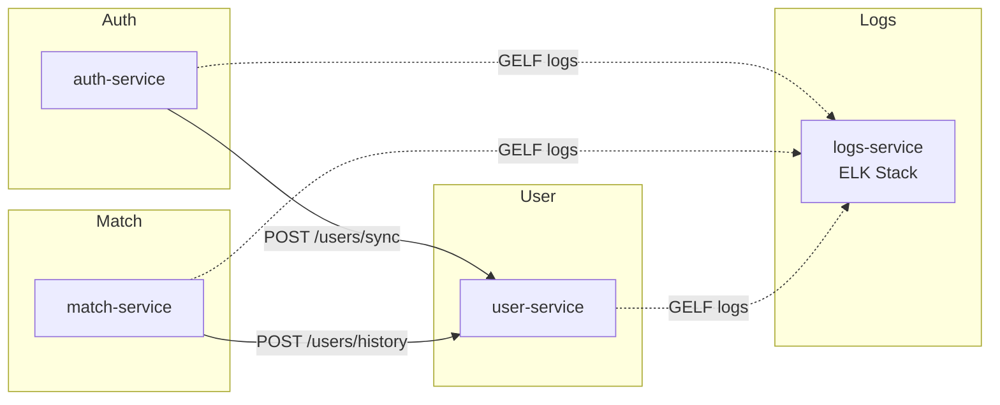

# 📦 Microservices Overview – ft_transcendence

Each service in this project has its own local README.

## 🚀 Quick Start

```bash
# Start everything
make up

# Stop everything  
make down

# Clean restart
make restart
```

## Available Services

| Service        | Description                         | Docs                                          |
|----------------|-------------------------------------|-----------------------------------------------|
| auth-service   | Handles registration and 2FA        | [auth-service/README.md](./auth-service/README.md)   |
| match-service  | Manages tournament logic            | [match-service/README.md](./match-service/README.md) |
| user-service   | Profiles, avatars, friends, history | [user-service/README.md](./user-service/README.md)   |
| logs-service   | ELK stack for log monitoring        | [logs-service/README.md](./logs-service/README.md)   |

---

## 🏗️ Architecture

```
┌─────────────┐    ┌─────────────┐    ┌─────────────┐
│ Auth        │    │ Match       │    │ User        │
│ Service     │    │ Service     │    │ Service     │
│ :3001       │    │ :3002       │    │ :3003       │
└──────┬──────┘    └──────┬──────┘    └──────┬──────┘
       │                  │                  │
       └──────────────────┼──────────────────┘
                          │ GELF Logs
                          ▼
                 ┌─────────────┐
                 │ Logs        │
                 │ Service     │ ← Process/Transform
                 │ ELK Stack   │   (Logstash:12201)
                 └──────┬──────┘
                        │
                        ▼
                 ┌─────────────┐    ┌─────────────┐
                 │Elasticsearch│    │   Kibana    │
                 │ :9200       │ ←→ │ :5601       │
                 │ + ILM       │    │ + Dashboards│
                 └─────────────┘    └─────────────┘
```

## Service Communication



- **auth-service** ⟶ **user-service**  
  After a successful registration, sends:
  ```http
  POST http://user-service:3003/users/sync
  Content-Type: application/json

  { "alias": "john" }
  ```
- **match-service** ⟶ **user-service**  
  After a match ends, sends two calls:
  ```http
  POST http://user-service:3003/users/history
  Content-Type: application/json

  { "alias":"winner", "opponent":"loser", "result":"win", "date":"<ISO>" }

  POST http://user-service:3003/users/history
  Content-Type: application/json

  { "alias":"loser", "opponent":"winner", "result":"loss", "date":"<ISO>" }
  ```

Cookie-based authentication is used for all protected endpoints across services.

---

## Environment Configuration

All services use a centralized `.env` file located in the project root directory. This file contains all environment variables needed for the microservices:

```
ft_transcendence/
└── .env  # Centralized environment variables for all services
```

The environment variables include:
- **Shared variables**: 
  - `COOKIE_SECRET`: Shared secret key for cookie signing and session management
  - `LOG_LEVEL`: Logging level for all services (default: "info")

- **Service-specific variables**:
  - `AUTH_DB_PATH`, `AUTH_MAIL_USER`, `AUTH_MAIL_PASS`: Auth service configuration
  - `USER_DB_PATH`: User service database path
  - `MATCH_DB_PATH`: Match service database path

## Logging System

All services implement structured logging with the following features:

- **ELK Stack Integration**: All logs are sent to an ELK (Elasticsearch, Logstash, Kibana) stack for centralized monitoring
- **GELF Format**: Logs are transmitted using the GELF format via Docker's logging driver
- **Request Tracking**: Every request receives a unique `request_id` for tracing across services
- **Structured Data**: Log entries include standardized fields:
  - `action`: The specific action being performed
  - `service_name`: The service generating the log
  - `level`: Log severity level (info, warn, error)
  - `request_id`: Unique identifier for request tracing
  - `alias`: User alias when applicable

Example log entry in Kibana:
```json
{
  "@timestamp": "2025-06-23T01:57:38.416Z",
  "service_name": "auth-service",
  "level": 30,
  "log_message": "Server listening at http://0.0.0.0:3000",
  "container_name": "auth-service",
  "tag": "auth-service"
}
```

Each service provides a `/test-log` endpoint to verify log delivery to the ELK stack.

---
